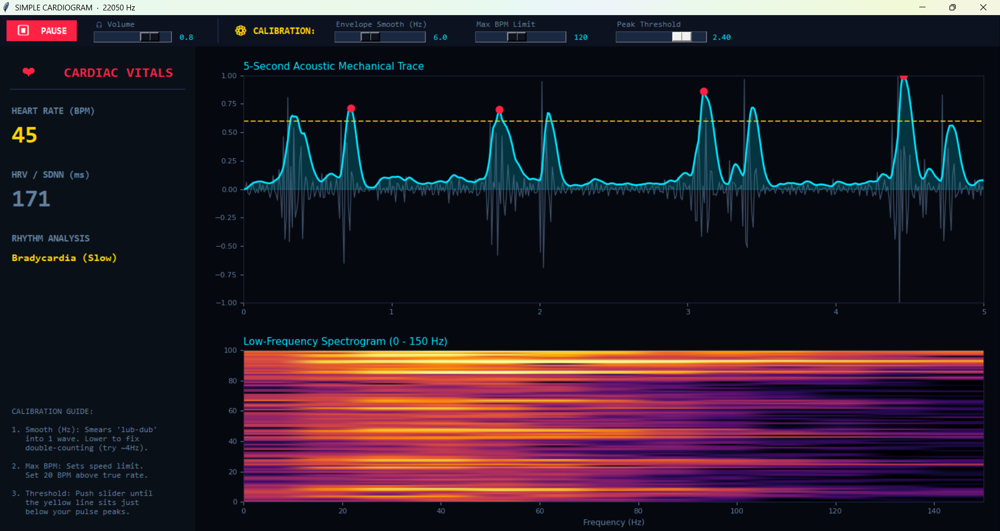
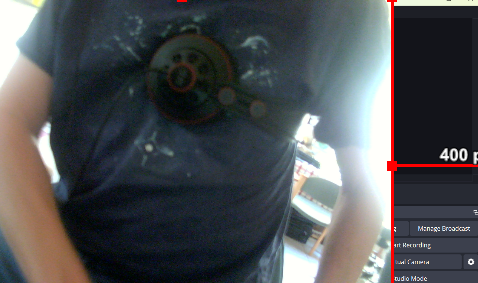

# TEMPEST Acoustic Cardiac Monitor

**PerceptionLab** *A high-speed acoustic cardiology and biometric extraction engine.*



TEMPEST Cardiac Monitor is a Python-based signal processing suite that transforms standard audio interfaces, ie headphones on chest.
This engine uses phase-locked mechanical tracing and optimized Fourier Transforms to extract human biometrics (S1/S2 heart valves)
from ambient hardware noise and raw acoustic data.

## Features

* **Live Mechanical Trace:** A highly optimized 5-second scrolling waveform isolating the physical "lub-dub" impacts of the cardiac cycle.

* **Low-Frequency Spectrogram:** A targeted 0–150 Hz waterfall display that isolates the deep-frequency acoustic signatures of heart valves closing.

* **Dynamic Peak Tracking:** Real-time visual limiter (yellow threshold line) and peak detection (red markers) for instant visual feedback on pulse tracking.

* **Real-Time Vitals:** Calculates Beats Per Minute (BPM), Heart Rate Variability (HRV / SDNN), and performs basic rhythm classification (Bradycardia, Tachycardia, Arrhythmia detection).

* **Calibrated Sonification:** Bandpasses the incoming signal (15-150 Hz) to strip out room noise and high-frequency hiss, feeding a pure, isolated thump back to the user's headphones.



## Requirements

The engine relies on standard scientific and audio libraries. 

```bash
pip install numpy scipy matplotlib sounddevice
```

(Note: tkinter is used for the GUI, which is included in standard Python distributions).

Usage
Run the script:

```Bash
python simple_cardiogram.py
```

Select your hardware: Choose your audio interface (e.g., Focusrite) from the startup menu. Set the sample rate to 48000 Hz.

Sensor Placement: Place your headphones, contact mic, or sensor flat against the left chest wall, just below the pectoral muscle.

Hit Start.

# Calibration Guide

Because mechanical acoustic data varies wildly depending on the sensor and the subject, the engine features a live Calibration Rack to dial in the math:

Envelope Smooth (Hz): Controls the low-pass filter on the rectified audio. Lower this value (e.g., ~4.0 Hz to 6.0 Hz) to mathematically smear 
the double-impact of the S1/S2 valves into a single waveform. This prevents the engine from double-counting beats.

Max BPM Limit: Acts as a speed limit for the peak-detection algorithm. Set this roughly 20 BPM above your actual heart rate to prevent the 
system from counting rapid echoes or breathing artifacts.

Peak Threshold (Squelch): Adjust this slider until the dynamic yellow limiter line sits just below the peaks of your pulse. Anything above
the line triggers a beat; anything below is treated as background mechanical noise.

# Architecture & Optimization Notes

This engine is designed to maintain high temporal resolution without crashing the main thread:

Audio Threading: Audio is processed asynchronously into a thread-safe deque buffer.

Strict Decimation: The 5-second mechanical trace is dynamically downsampled to a maximum of 500 render points per frame to ensure matplotlib maintains a high refresh rate.

FFT Optimization: The spectrogram utilizes a 2048-point Fast Fourier Transform (FFT), isolating only the bins under 150 Hz to minimize unnecessary matrix math on the frontend.

Developed for PerceptionLab.
